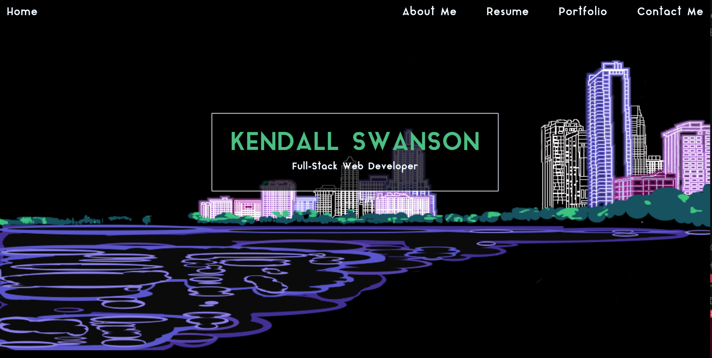
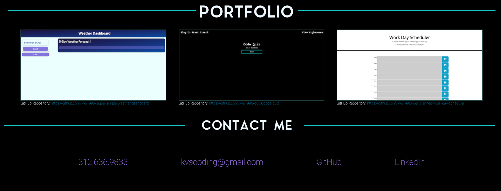

# Kendall Swanson - Portfolio V2 

  Learn about me and see how my coding knowledge has grown as I utilize CSS and HTML to create a fun responsive portfolio. This includes a brief biography of how I got into this field, as well as what projects I have under my belt. I hope that it gives you a sense of who I am and why I love creating these websites so much! 

  # Table of Contents
  * [Installation](#installation)
  * [Usage](#usage)
  * [Contribution Guidelines](#contribution-guidelines)
  * [Tests](#tests)
  * [Questions](#questions)
  * [License](#license)

  ---
  ## Installations
  No installation instructions - simply click the link to the deployed application and enjoy. 

  ## Usage
  This is the second version of my portfolio, built from scratch. 
  
  Take a look at this short video for a walkthrough on how to use the application:

  
  
  

  ## Contribution Guidelines
  No guidelines, except please do not copy the image that is serving as my background. This is a design that is still in progress and that is my own.

  ## Tests
  No test instructions.

  ## Questions
  
  If you have any questions or would like to contact me regarding aspects of this project, I can be reached at:
  * GitHub: kvs1995
  * Email: kvswan6408@gmail.com

  ## License: MIT
      This project is licensed under the [MIT License](https://opensource.org/licenses/MIT).
